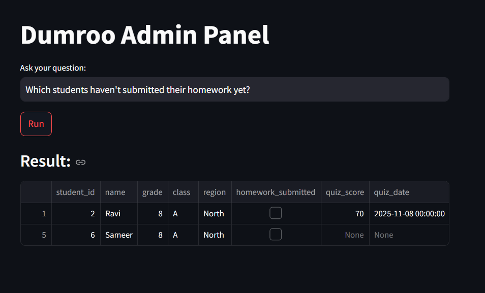

# Dumroo.ai — Admin Natural Language Query System

This project implements an AI-enabled admin query tool where administrators can ask questions in simple English and receive filtered results from a student dataset.  
It includes **role-based access control (RBAC)** so admins only see the data they are allowed to access.

---

## 🛡️ Role-Based Access Control (RBAC)

Each admin has a defined access **scope**, such as:

- `{"grade": 8, "class": None, "region": None}`  
  → Admin can view **all Grade 8** students.

- `{"grade": None, "class": None, "region": "North"}`  
  → Admin can view **all students in North region**.

- `{"grade": None, "class": None, "region": None}`  
  → Admin can view **all rows** (no restrictions).

### The system automatically:
- Applies scope filtering before showing results  
- Prevents admins from requesting data outside their scope  
- Overrides query filters to match allowed boundaries  

This ensures that **an admin only sees what they are authorized to see**.

---

## 🧠 Tech Stack

- **Python 3.10+**
- **Pandas** — data reading & filtering  
- **Streamlit** — UI for interacting with the system  
- **dateparser / dateutil** — parsing natural date expressions  
- **Rule-based NLP parser** (LLM-ready architecture)

---

## ▶️ How to Run

### **1. Install dependencies**
```bash
pip install -r requirements.txt
```

### **2. Run the Streamlit App**
```bash
streamlit run src/ui_streamlit.py
```
---

## 📸 Result Screenshot

Here is an example of the system output:




